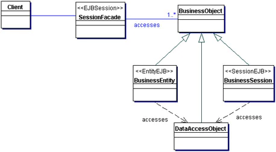

# Phoenix 1.3 and Contexts

Cleaver Barnes

2017-09-13

## About me

### About me

Learned functional programming before OOP

 - Lisp
 - Prolog

Haven't had a real job since the 90's

Location independent

### Stuff I use

- Javascript / PHP
- Java
- Ruby / Rails
- Elixir / Phoenix

## My project

### Conference registration

Replace old CMS-based ecommerce platform

Why?

### Why?

- Drupal
- PHP
- Elixir

## Phoenix 1.3

### Phoenix 1.3

#### Several new features.

Most significant is probably Contexts

See: https://youtu.be/tMO28ar0lW8

### Contexts - What?

- *Bounded Context* concept
- From Domain Driven Design

See: https://www.martinfowler.com/bliki/BoundedContext.html

### Contexts - What?

#### Phoenix 1.2

### Contexts - What?

#### Phoenix 1.3

### Contexts - How?

    mix phx.gen.html Context Post posts title:string body:text

Generates:

    lib/elixir_demo/context/context.ex
    lib/elixir_demo/context/post.ex
    lib/elixir_demo_web/controllers/post_controller.ex
    lib/elixir_demo_web/templates/post/edit.html.eex
    lib/elixir_demo_web/templates/post/form.html.eex
    lib/elixir_demo_web/templates/post/index.html.eex
    lib/elixir_demo_web/templates/post/new.html.eex
    lib/elixir_demo_web/templates/post/show.html.eex
    lib/elixir_demo_web/views/post_view.ex
    priv/repo/migrations/20170910172620_create_posts.exs
    test/elixir_demo/context/context_test.exs
    test/elixir_demo_web/controllers/post_controller_test.exs

### Contexts - How?

#### Previously in 1.2

    def index(conn, _params) do
      posts = Repo.all(Post)
      render(conn, "index.html", posts: posts)
    end

Calls *Ecto* directly from the controller with `Repo.all()`.

### Contexts - How?

#### Now in Phoenix 1.3

    def index(conn, _params) do
      posts = Context.list_posts()
      render(conn, "index.html", posts: posts)
    end

Controller knows nothing about Ecto.

Controller calls the *Context* rather than using Ecto.

### Contexts - controversy?

Elixir Forum:

>Contexts - a barrier too high for newbies?
>
>The reason that Rails is as popular as it is is because it's very easy for relatively inexperienced developers to get a lot of work done. Is that work a poorly designed mess? Yes, yes it is. And so what?

### Façade Pattern

See: http://www.oracle.com/technetwork/java/sessionfacade-141285.html

### What Next?

#### Write your own context functions!

    user = Context.get_user_and_posts(123)

Produces:

    %User{
      name: "Foo",
      email: "foo@example.com",
      posts: [
        %Post{
          title: "A history of Foo",
          body: "Lorem..."
        },
        %Post{
          title: "How to Bar",
          body: "Ipsum"
        }
      ]
    }

### What Next?

#### Transactions

*"earlier passes of the generators used `Ecto.Multi` and `Repo.transaction` because I wanted folks to learn about transactions"*

— Chris McCord

See: https://elixirforum.com/t/contexts-a-barrier-too-high-for-newbies/5929/158

### My Project

#### Impressions

- Efficiency of development
- Getting up to speed
- Write tests

### Downsides?

#### Generated code

All the context functions are crammed into one file.

## Merci!

### Questions?

### This Presentation

https://github.com/cleaver/elixir-presentation-2017-09
